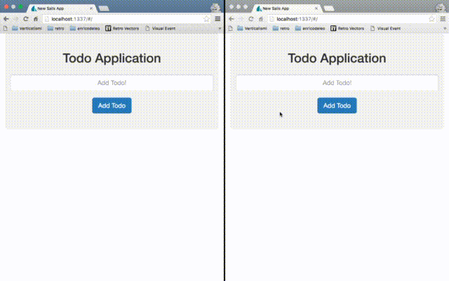

# [EXAMPLE APP] Sails.js real time todo

a [Sails](http://sailsjs.org) application that show how to build a simple todo app with realtime updates using socket.io (bundled with sails.js).

## Tools used

- Angularjs
- Bootstrap
- Socket.io
- JST templates (thanks to [this module](https://gist.github.com/enricodeleo/340a7819dce306ab8e56bd5dda533b04) that make angular understand them)

## Test this app

Just clone this repo, `cd` into it then install dependencies

```shell
npm install -g sails && npm install && bower install
```

visit the default address `http://localhost:1337`

